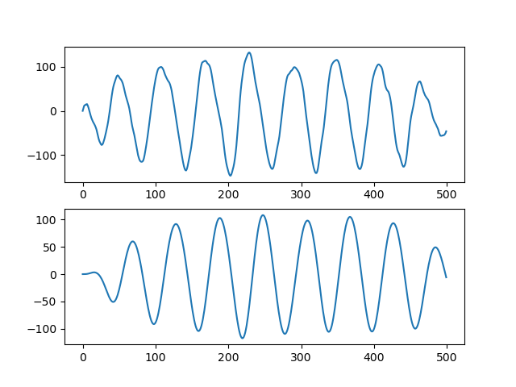

# Lab 5 Report
### Seok Jun Park (A15745118)
Lab Partner: Kanishka Roy  
Date: 05/10/2021

## Tutorials

### Tutorial 1: Offline Data Analysis

In this tutorial, we are introduced to **Data Analysis**.  
The goal of this tutorial is:  
1. Collecting 10 seconds of data from the accelerometer.
2. Save it to a file.
3. Load and visualize the samples to see if we can "see" steps.

For the first step, we learned how to utilize the data easily read and write comma-separated value(CSV) files.  
A single line above will save an array (data) into a file(filename) and each entry will be separated (delimited) by commas.

     np.savetxt(filename, data, delimiter=",")

Another line below will reverse that operation and load the data into the variable as a **Numpy** array.

     data = np.genfromtxt(filename, delimiter=",")

For this tutorial, we take **L1-Norm** to detect the steps, so the progresses are as following:
1. Collect samples while walking
2. Save the samples to a file
3. Load the file
4. Compute the L1-Norm
5. Plot the L1-Norm

I tried several times to collect good data to visualize, and the plot of that good data is as following:

As I counted myself while I was walking and as shown in the plot, there are about 9 steps counted. 

### Tutorial 2: Digital Signal Processing (DSP)

In this tutorial, we are introduced to use the data to begin designing a signal processing pipeline. In the
first portion of tutorial, we are introduced several techniques for processing signals both in time and frequency
domains. In the second portion, we will assemble these functions into a filtering class that will be used in the challenges
and also the wearable design.

**Part 1: Digital Filtering**

***Time Domain Signal Processing***  
1. **L1-Norm**: Absolute-Value Norm = |x| + |y| + |z|
2. **Moving Average Filter**: Smoothing out the "wiggly" noise from L1-Norm using a moving average, which is a windowed
average while we move along chunks of the data.
3. **Detrending**: Subtracting the moving average from the signal of interest, removing the mean of the signal chunk-by-chunk
so that the signal can be arranged on zero. 
4. **Gradients**: Calculating the change between subsequent samples with the derivative. 

***Frequency Domain Signal Processing***
1. **Power Spectral Density(PSD)**: Computing the power distribution over the frequency domain. The higher the power
of a specific frequency, the more that frequency contributes to the composition of the signal. 
   1. Note that if we want to take 50Hz of sampling, the half of the sampling frequency is the **Nyquist** frequency.
2. **Low-pass & High-pass Filtering**: Low-pass filter passes the lower frequency, and High-pass filter passes the higher frequency.
   There are two functions for low-pass filter.
   1. signal_filtered = sig.**lfilter**(b, a, signal_in)
   2. signal_filtered_better = sig.**filtfilt**(b, a, signal_in)

***Signal Post-Processing***
1. **Finding Peaks**: We know where the peaks in the signal are located.
   
       peaks, props = signal.find_peaks(<signal>, threshold=0)

2. **Counting Peaks**: By using **find_peaks** function above, make an algorithm for counting peaks.

       # Count the Number of Peaks
       def count_peaks(x, thresh_low, thresh_high):
       peaks, _ = sig.find_peaks(x)

       count = 0
       locations = []
       for peak in peaks:
          if x[peak] >= thresh_low and x[peak] <= thresh_high:
             count += 1
             locations.append(peak)

       return count, locations

All the images showing all the steps we have talked about are shown below:

| L1-Norm Filter  | Moving Average | 
|----|----|

| Detrending  | Gradients  | 
|----|----|

| Power Spectral Density  | Frequency Response | 
|----|----|

| Low-pass Lfilter  | Low-pass Filtfilt | 
|----|----|
| **Counting Peaks**  | |

**Part 2: DSP Module**  

This part is just the same progress as what we have done in Part 1, but we are making the whole progress inside a package
so we can use more broadly. After we create a new library file to function the filtering processes from part 1, and reinstall
the package to our Python folder, we are good to test it out! The final progress should be a plotting the "Detected Peaks", and 
the result also should be the same as we got in Part 1.  
The image below shows that the results are identical from Part 1 and Part 2.

| Counting Peaks | DSP Module  | 
|----|----|

### Tutorial 3: Pedometer Class

In this tutorial, we are creating **Pedometer Class** to count our steps while we are walking with our ESP32, by using 
the filtering progresses we learned from Tutorial 2. The codes for filtering parts are as following:

    """
    Process the new data to update step count
    """
    def process(self):
        # Grab only the new samples into a Numpy array
        x = np.array(self.__l1[ -self.__new_samples: ])
        
        # Filter the signal (detrend, lp, ma, etc ...)
        ma = filt.moving_average(x, 20)                   # Compute Moving Average
        dt = filt.detrend(ma)                             # Detrend the Signal
        x = filt.filter(self.__b, self.__a, dt)           # Low-pass Filter Signal

        # Store the filtered data
        self.__filtered.add(x.tolist())

        # Count the number of peaks in the filtered data
        count, peaks = filt.count_peaks(x, self.__thresh_low, self.__thresh_high)
        
        # Update the step count and reset the new sample count
        self.__steps += count
        self.__new_samples = 0

        # Return the step count, peak locations, and filtered data
        return self.__steps, peaks, np.array(self.__filtered)

The plot is just the same as what we got from Tutorial 2 as well:

We can test it online while we are actually walking with our ESP32 on our hands. 

## Challenges

### Challenge 1: Online Pedometer

The goal of this challenge is to create a completed Pedometer. The logical flows of Pedometer are as below:

1. Python sends "wearable" to the MCU to start streaming data.
2. The Pedometer receives the data in Python.
3. Periodically (e.g., once every second), the Pedometer processes the received data and updates the step count.
4. The Python program sends the step count back to the MCU.
5. The OLED displays the current step count. 

### Challenge 2: Jumping Jack Counter

The goal of this challenge is to create a jumping jack counter. The logical flows of our jumping jack counter are as below:

1. Once the program starts, we store the data of jumping to MCU as an array while we are doing jumping jacks.
2. If we are done enough jumping jacks, press BUTTON to see how many jumping jack we made. 
3. After press BUTTON, the Python program processes the data (filtering) to compute the right number of jumping jacks. 
4. Finally, our OLED displays the completed Jumping Jacks we made! 

Below, you can see our jumping jack counter works correctly. As shown in GIF, I did 4 jumping jacks, and OLED printed the 
value of jumping count as "Jumps: 4" once I pushed the BUTTON. 

**Let's Do Jumping Jack**  
 

